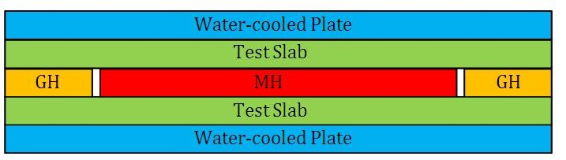

## Procedure

### Apparatus

A circular main heater plate (MH) is surrounded by an annular guard heater plate (GH) with a narrow air gap in between. Each heater is made up of electrical resistance wire sandwiched between two copper plates. Thermocouples are fixed to the plates to measure their surface temperatures.
Two identical circular slabs of the material to be tested are placed on either side of and in good thermal contact with the heater plates. On the outer sides of the two slabs, in good thermal contact, are two circular water-cooled slabs whose surface temperatures can also be monitored with thermocouples (Fig 1).
The purpose of the guard heater is to prevent heat loss from the edge of the main heater by maintaining the temperature outside the main heater at the same temperature as the main heater. This ensures that all heat lost from the main heater flows through the test slabs.

  
  
Figure 1: Arrangement of two identical circular slabs of the material to be tested; GH: Guard heater, MH: Main heater

<iframe width="560" height="315" src="https://www.youtube.com/embed/mR2lxfyk6sk" frameborder="0" allow="autoplay; encrypted-media" allowfullscreen></iframe>

### Performing Simulation:
 
#### Simulator Controls

 
1.	The <strong>Choose Material </strong>combo box is used to select the material for the test slab. 
2.	The<strong> Diameter of the material </strong>slider is used set the diameter of the portion of the test slab in contact with the main heater, in cm 
3.	The <strong>Thickness of material </strong>slider is used to set the thickness of the test slab, in cm. 
4.	The <strong>Coldwater temperature</strong> slider is used to set the temperature ( in degrees Celsius) of the water flowing inside the outer plates.   
5.	The <strong>White knobs in simulator</strong> can be rotated by clicking side arrows to adjust the voltage and corresponding current, which can be used to calculate input power. 
6.	The <strong>MH-GH Switch </strong>is used to set either main heater (MH) or guard heater (GH) voltage and current as shown on the meters. Note: For the simulator to be powered on, the voltage for both heaters must be the same.  
7.	<strong>The Power on button </strong>switches <strong>on </strong>the power after the initial adjustments are done. 
8.	The <strong>Temperature indicator </strong>is used to read the temperature at the positions of the various thermocouples. After a steady state is reached (when the timer shows 20 minutes), click the arrows on either side of the knob to read temperatures<em>  T</em><em>1</em> to <em>T</em><em>8</em>  in degrees Celsius.

### Procedure for Simulation

1. Choose the material from combo box. 
2.	Using the sliders, fix a particular diameter for the portion of the test slab in contact with the main heater, and a thickness for the entire slab. 
3.	Adjust the cold water temperature using the slider. 
4.	Using the white knobs, fix the value of same voltage and current for both main heater (MH) and guard heater (GH). With  the MH-GH switch set to MH, use white MH knob to set the voltage and current for the main heater. Then click the MH-GH switch to GH and use the white GH knob to set the voltage and current for the guard heater to the same values you set for the main heater. 
5.	Click the Power On switch to power the unit on. 
6.	After  a steady state is reached (20 minutes in the timer), use the temperature indicator to read and note down <em>T1,  T2, T3, T4, T5, T6, T7 </em>and <em>T8.</em>
7. Using the work sheet and the equations from the theory page, calculate the thermal conductivity of the test slab. Note: since the main heater is in contact with a test slab on both sides, the area A in equation

$A=\frac{\pi l^{2}}{4}............(1)$

where d is the diameter of the MH, not , as might first be assumed.

### Procedure for Real lab

The procedure for the real lab is quite similar. The main differences are (1) the guard heater can be set to a slightly different temperature, as needed, to keep the temperature of the main heater uniform, and (2) the calculations can be extended to allow for and/or find the dependence of k on $|delta T$.

###  Observations and Calculations

Mean temperature at the surface of the specimen on the heater side,

$$T_{h}=\frac{(T_{1}+T_{2}+T_{3}+T_{4})}{4}=................^{0}C$$

Mean temperature at the surface of the specimen on cold plate side,
$$T_{c}=\frac{(T_{5}+T_{6})}{2}=................^{0}C$$

Area of heat transfer,

$$A=\frac{\pi l^2}{4}=.............m^{2}$$

In above equation, d is the diameter of the specimen

Heat transferred,    

$$Q=\frac{Vl}{2}=\frac{kA(T_{h}-T{c})}{\Delta x}$$

$\Delta x$ is the thickness of the specimen. 

Thermal conductivity    $k=$........... $Wm^{-1}K^{-1}$
### Result:
 
Thermal conductivity of the given specimen by conduction = ..............     $Wm^{-1}K^{-1}$

