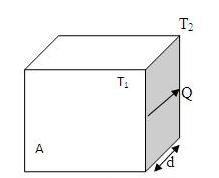

### Theory

<iframe src="https://www.youtube.com/embed/mR2lxfyk6sk" frameborder="0" allow="autoplay; encrypted-media" allowfullscreen></iframe>

The theory of heat transfer seeks to predict the energy transfer that may take place between material bodies as a result of temperature difference. This energy transfer is defined as heat. The three modes by which heat can be transferred from one place to another are conduction, convection and radiation.
In conduction, heat is carried by means of collisions between rapidly moving molecules closer to the hot end of a body of matter and the slower molecules closer to the cold end. Some of the kinetic energy of the fast molecules passes to the slow molecules, and as a result of successive collisions, heat flows through the body of matter from the hot end to the cold end. Solids, liquids, and gases all conduct heat. Conduction is poorest in gases because their molecules are relatively far apart and so interact less frequently than in solids and liquids. Metals are the best conductors of heat because some of their electrons are able to move about relatively freely and can interact frequently by collisions.

Without the guard heater, cooler air surrounding the edge of the main heater would be heated by conduction and convection. Thus some of the heat supplied to the main heater would be carried away by the surrounding air.

With the guard heater in place and adjusted to the same temperature as the main heater, the air in the gap between is maintained at the temperature of the main heater, so no heat is lost at the edge of the main heater. All heat lost from the main heater must flow into the test slabs.

  
  
Figure 2:Heat conducted through a slab

Consider one dimensional heat conduction (Fig 2). The rate at which heat is conducted through a slab of a particular material is proportional to the area A of the slab and to the temperature difference ($\Delta T$) between its sides and inversely proportional to the slab's thickness d.
The amount of heat Q that flows through the slab in the time t is given by

Rate of conduction 

$$\frac{Q}{t}=\frac{(kA\Delta T)}{d}$$

$$k=\frac{Qd}{tA\Delta T}........(1)$$

Where $\Delta T = T_{1}-T{2}$, and $k$ is the thermal conductivity of the material, is a measure of its ability to conduct heat. The SI unit of $k$ is $Wm^{-1}K^{-1}$.

Thermal conductivity: Note that a heat flow rate is involved, and the numerical value of the thermal conductivity indicates how fast heat will flow. In general, thermal conductivity is strongly temperature dependent. It has the units of watts per meter per Kelvin. Heat transfer by conduction in a solid can be realized through the support of phonons, electrons and photons. The individual contributions of these carriers widely depend on material and its temperature. Thermal conductivity is thus a second order tensor, but in a material with cubic isotropy it reduces to a scalar. It is an intensive property (changing the amount of material does not change its thermal conductivity) and is a function of both pressure and temperature.

The thermal resistance R of a layer of a material of thickness d and of thermal conductivity k is given by

$$R=\frac{d}{k}..............(2)$$

The greater the value of R, the greater the resistance to the flow of heat.

### Applications
Heat transfer has wide applications for the proper functioning of thermal devices and systems. This principle is used to solve many problems in thermal mechanics.

1. Heat exchangers.
2. Building construction works.
3. Thermal energy storage devices.
4. Heat transfer in human body.
5. Thermopile and infrared thermometer.
6. Thermal resistance in electronics like thermal diode or thermal rectifier.
7. Used in laser cooling, radiative cooling, magnetic cooling, etc.
